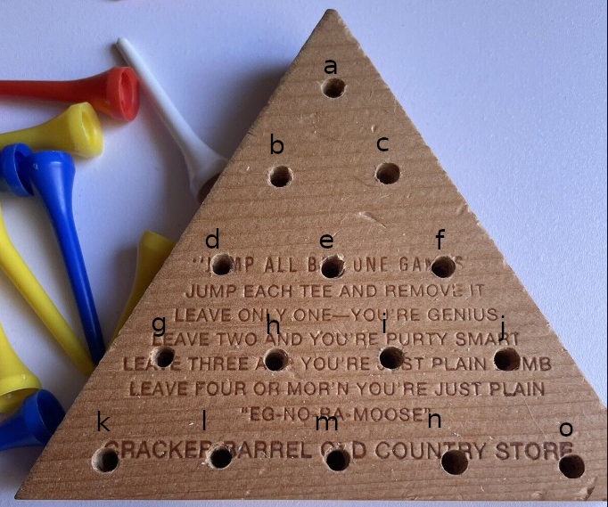

# golf_tee_game
Play every possible golf tee game

I got tired of getting called an "EG-NO-RA-MOOSE" at Cracker Barrel, so I wrote a Ruby program
that would play every single golf tee game:

I began by labeling the spaces as can be seen in the above image.

# Running gtg.rb
The `gtg.rb` script requires `golf_tee_board.rb`, which is the class defined to represent the board.  It uses the [Ruby Graph Library](https://github.com/monora/rgl)
to implement the board as a graph.  The class implements the game's rules, then plays every single game, creating a log of its output.

Running `gtg.rb` will take a long time.  If I remember correctly it took me a couple of weeks to run it for every possible open spot.

First you'll need to install `rgl`.  You can do that manually with `gem install rgl` or else use `bundle install` if you have `bundler` installed.
If you run `bundle install` ensure you're in the top level of this repository.

Either run `./gtg.rb <open_location>` to create output for one location, or `./scripts/play_all_games.sh` to play all games.  This will
create log files in `./logs` of the format `gtg-[a-o].log` which contain all possible games for that initial open space.

# Running reports
Running `./scripts/report.rb <log_file> <remaining_golf_tees>` will run a report of all games in that log file that result
in the given number of remaining golf tees.

Running `./scripts/run_all_reports.sh` will run a report for every initial open space for all games with one, two, and three pegs remaining.

# Running stats
Running `./scripts/run_stats.sh` analyzes the outputs from running `./scripts/play_all_games.sh` and `./scripts/run_all_reports.sh` and
creates a CSV.

Here are the stats:
|open_space|total  |one_peg_games|two_peg_games|three_peg_games|
|----------|-------|-------------|-------------|---------------|
|a         |568630 |29760        |139614       |259578         |
|b         |294543 |14880        |70481        |133919         |
|c         |294543 |14880        |70481        |133919         |
|d         |1149568|85258        |290954       |510556         |
|e         |137846 |1550         |20686        |62736          |
|f         |1149568|85258        |290954       |510556         |
|g         |294543 |14880        |70481        |133919         |
|h         |137846 |1550         |20686        |62736          |
|i         |137846 |1550         |20686        |62736          |
|j         |294543 |14880        |70481        |133919         |
|k         |568630 |29760        |139614       |259578         |
|l         |294543 |14880        |70481        |133919         |
|m         |1149568|85258        |290954       |510556         |
|n         |294543 |14880        |70481        |133919         |
|o         |568630 |29760        |139614       |259578         |

The file `stats.csv` is included in this repository.

As can be seen above, {a,k,o} (the points) form a congruent group, as do {b,c,g,j,l,n} (the pairs adjacent to the points), as well as {d,f,m} (the outer midpoints), and {e,h,i} (the centroids).  
<table>
<thead><td>&nbsp;</td><th>points</th><th>point_adjacent_pairs</th><th>outer_midpoints</th><th>centroids</th></thead>
<row><td><b>pct 1-peg</b></td><td>5.234%<td>5.052%</td><td>7.417%</td><td>1.124%</td></row>         
</table>

# Accessing the logs
The log files are quite large.  Zipped, they are over 300MB, which is over GitHub's limits.  No worries, though.  I have
made them available on Google Drive [here](https://drive.google.com/file/d/1T_EdX8Fee5mfVQwmG_EHOv2UHYAM7Kyh/view?usp=sharing).

# Generating logs or reports as a GitHub Action?
This would be possible - but I fear I would have to deal with timeouts in GitHub Action runners.
